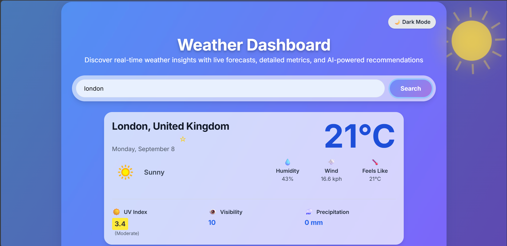
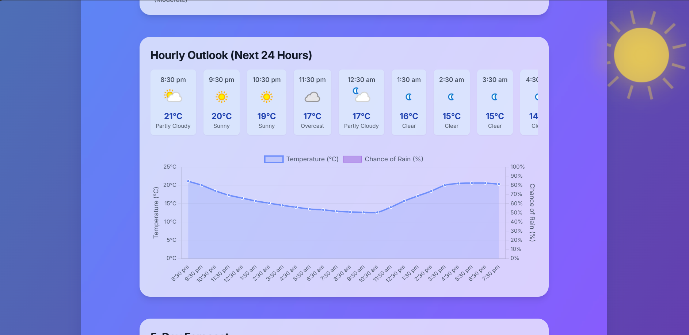
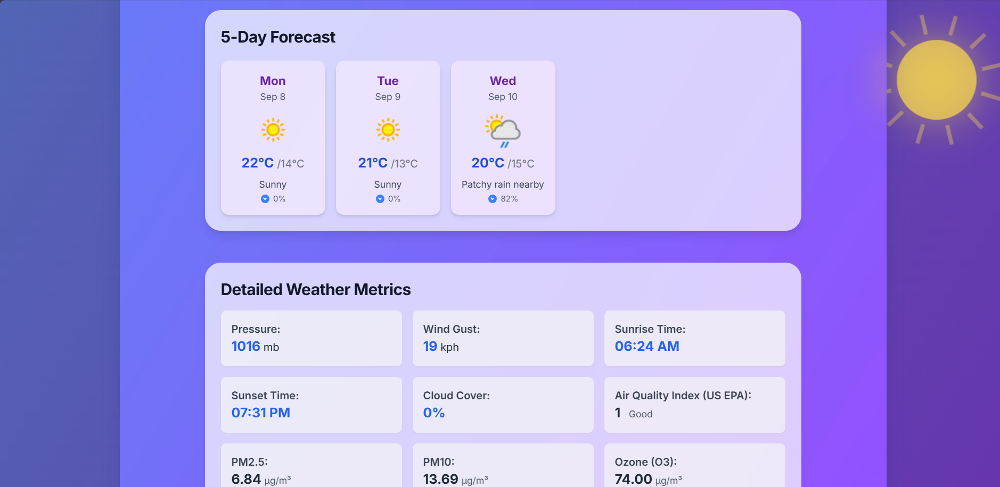
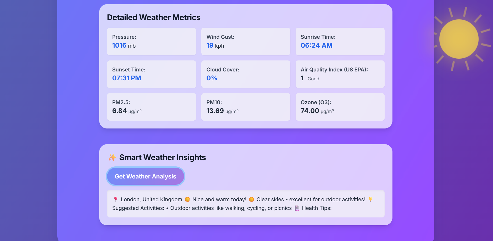

# Weather Dashboard

A modern, interactive weather dashboard built with HTML, CSS (Tailwind + custom), and JavaScript. For the public GitHub version, all API keys and sensitive endpoints have been removed for security. Demo images are included below.


## Demo Screenshots

[](image.png)
*Main weather dashboard demo screenshot*

[](image copy.png)
*Alternate dashboard view 1*

[](image copy 2.png)
*Alternate dashboard view 2*

[](image copy 3.png)
*Alternate dashboard view 3*

## Features
- **Live Animated Backgrounds** - Dynamic weather effects (rain, snow, clouds, sun rays, thunder) that change based on current conditions
- **Search weather by city name** with autocomplete suggestions
- **Current conditions, hourly and 5-day forecast** with detailed metrics
- **Advanced metrics**: AQI, UV, visibility, cloud cover, pollutants, etc.
- **Weather alerts** (if available) with detailed information
- **Favorites system** - Save and quickly access your favorite locations
- **Smart Weather Insights** - Local analysis with activity suggestions and health tips
- **Responsive, mobile-friendly design** with modern UI
- **Performance optimized** animations and effects

## Setup
1. **Clone this repository:**
   ```sh
   git clone <your-repo-url>
   cd <repo-folder>
   ```
2. **API Key:**
   - For security, the API key and API code have been removed from this public repository. To enable live weather data, add your own API key and endpoint in `weather3.html` and `script.js` as described in the code comments.
3. **Run Locally:**
   - Open `weather3.html` in your browser.

## Files
- `weather3.html` — Main HTML file with all JavaScript functionality
- `style.css` — Custom CSS with modern design and animations
- `script.js` — Additional script file (optional)
- `README.md` — This file
- `.gitignore` — Git ignore rules

## Features in Detail
- **Live Background Effects**: Canvas-based animations that match the weather (rain, snow, clouds, sun rays, thunder)
- **Favorites**: Click the star next to any city to save it for quick access
- **Smart Insights**: Get personalized activity suggestions and health tips based on weather data
- **Responsive Design**: Works perfectly on desktop, tablet, and mobile devices
- **Performance Optimized**: Smooth animations with reduced particle counts for better performance

## Deployment
- You can deploy this as a static site (GitHub Pages, Netlify, Vercel, etc.)
- No backend required - everything runs in the browser
- Favorites are stored locally in the browser

## License
MIT
